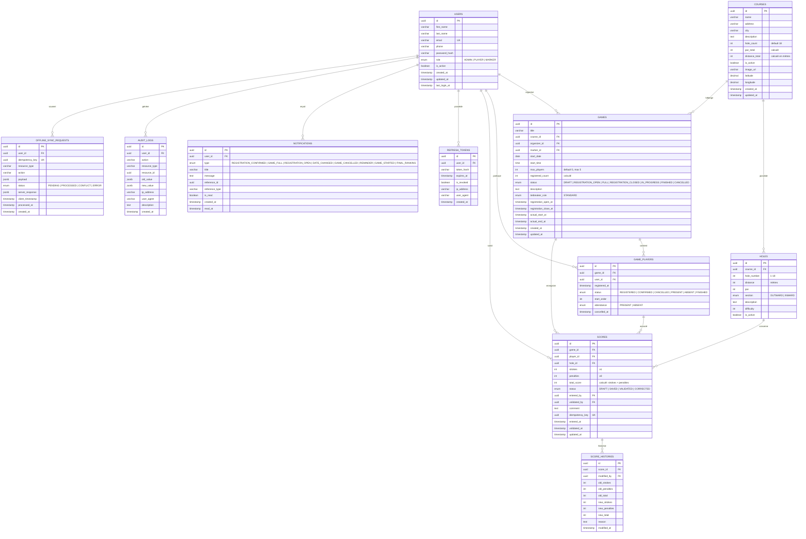
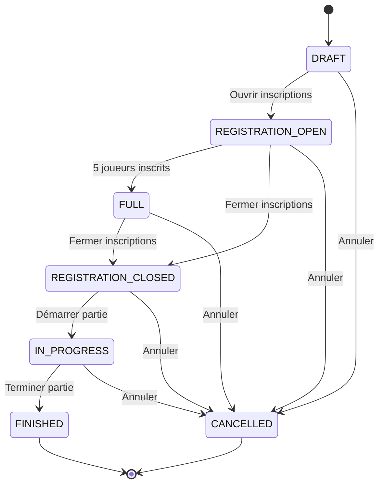
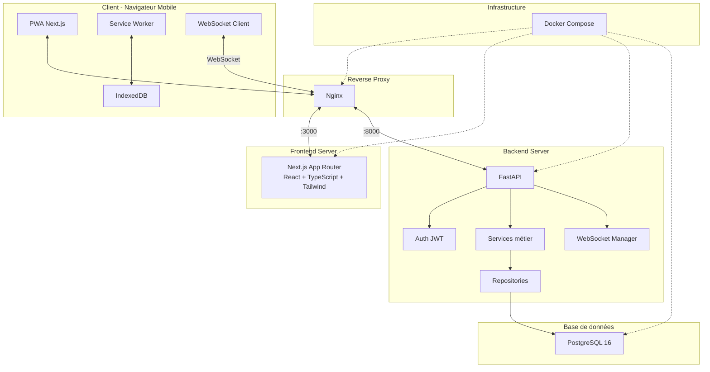

# FootGolf Score — Étape 1 : Analyse & Architecture

## 1. Analyse fonctionnelle

**FootGolf Score** est une application web mobile (PWA) destinée à remplacer la fiche de score papier lors des parties de FootGolf. Elle permet la gestion complète du cycle de vie d'une partie : création de parcours, ouverture des inscriptions, saisie des scores trou par trou, classement en temps réel et archivage des résultats.

### Contexte d'utilisation
- **Terrain de FootGolf** : les joueurs utilisent leur téléphone pendant le parcours, souvent sous le soleil, avec une seule main libre.
- **Connexion réseau instable** : les parcours sont souvent en pleine nature, avec une couverture 4G/5G partielle.
- **Simplicité critique** : les joueurs doivent pouvoir saisir un score en 3 secondes maximum.

---

## 2. Acteurs du système

| Acteur | Description | Authentification |
|--------|-------------|------------------|
| **Administrateur** | Gère les utilisateurs, parcours, parties. Peut corriger des scores, exporter des résultats. | JWT (rôle `ADMIN`) |
| **Joueur** | S'inscrit aux parties, saisit ses scores, consulte le classement et son historique. | JWT (rôle `PLAYER`) |
| **Marqueur** | Saisit et valide les scores des joueurs d'une partie. Peut être un joueur ou un tiers. | JWT (rôle `MARKER`) |
| **Système** | Calcule automatiquement les totaux, le classement, gère les WebSockets et la synchronisation hors ligne. | N/A |

---

## 3. Cas d'utilisation

### 3.1 Administrateur

| # | Cas d'utilisation | Priorité |
|---|-------------------|----------|
| UC-A01 | Se connecter | MVP |
| UC-A02 | Gérer les utilisateurs (CRUD + activation/désactivation) | MVP |
| UC-A03 | Attribuer un rôle à un utilisateur | MVP |
| UC-A04 | Créer/modifier/désactiver un parcours | MVP |
| UC-A05 | Configurer les 18 trous d'un parcours (PAR, distance) | MVP |
| UC-A06 | Créer/modifier/annuler une partie | MVP |
| UC-A07 | Gérer le cycle de vie d'une partie (ouvrir, fermer, démarrer, terminer, annuler) | MVP |
| UC-A08 | Ajouter/retirer un joueur manuellement | MVP |
| UC-A09 | Corriger un score avec justification | MVP |
| UC-A10 | Consulter l'historique des modifications | MVP |
| UC-A11 | Consulter tous les classements | MVP |
| UC-A12 | Exporter les résultats (PDF, CSV) | Sprint 2 |

### 3.2 Joueur

| # | Cas d'utilisation | Priorité |
|---|-------------------|----------|
| UC-J01 | Se connecter | MVP |
| UC-J02 | Consulter/modifier son profil | MVP |
| UC-J03 | Consulter les parties disponibles | MVP |
| UC-J04 | S'inscrire à une partie | MVP |
| UC-J05 | Annuler son inscription (avant démarrage) | MVP |
| UC-J06 | Saisir son score trou par trou | MVP |
| UC-J07 | Ajouter une pénalité | MVP |
| UC-J08 | Modifier un score non validé | MVP |
| UC-J09 | Suivre les scores en temps réel (WebSocket) | MVP |
| UC-J10 | Voir le classement en direct | MVP |
| UC-J11 | Consulter son historique de parties | Sprint 2 |
| UC-J12 | Consulter ses statistiques | Sprint 2 |

### 3.3 Marqueur

| # | Cas d'utilisation | Priorité |
|---|-------------------|----------|
| UC-M01 | Consulter les joueurs d'une partie | MVP |
| UC-M02 | Saisir les scores des joueurs | MVP |
| UC-M03 | Valider un score trou par trou | MVP |
| UC-M04 | Corriger un score avant la fin | MVP |
| UC-M05 | Confirmer la carte de score finale | MVP |

---

## 4. Règles métier

### 4.1 Inscription

| # | Règle | Criticité |
|---|-------|-----------|
| RG-I01 | Un joueur ne peut s'inscrire qu'une seule fois à une même partie | Bloquante |
| RG-I02 | Maximum 5 joueurs actifs par partie | Bloquante |
| RG-I03 | L'inscription est transactionnelle (verrouillage optimiste avec `SELECT FOR UPDATE`) | Bloquante |
| RG-I04 | L'annulation est interdite après le démarrage de la partie | Bloquante |
| RG-I05 | Une place annulée redevient disponible | Importante |
| RG-I06 | Le statut passe automatiquement à `FULL` si 5 joueurs sont inscrits | Importante |

### 4.2 Scores

| # | Règle | Criticité |
|---|-------|-----------|
| RG-S01 | `score_total = coups + pénalités` | Bloquante |
| RG-S02 | Le backend est la source officielle du calcul | Bloquante |
| RG-S03 | `coups ≥ 1`, `pénalités ≥ 0` | Bloquante |
| RG-S04 | Un joueur a un seul score par trou par partie | Bloquante |
| RG-S05 | Un score validé ne peut être modifié que par un admin ou un marqueur | Bloquante |
| RG-S06 | Toute correction génère une entrée dans `score_histories` | Bloquante |
| RG-S07 | La partie ne peut pas être terminée si des scores manquent | Bloquante |
| RG-S08 | Chaque requête de score porte un `idempotency_key` (UUID) | Importante |

### 4.3 Calcul des totaux

| # | Règle |
|---|-------|
| RG-C01 | `total_aller = Σ scores trous 1→9` |
| RG-C02 | `total_retour = Σ scores trous 10→18` |
| RG-C03 | `total_général = total_aller + total_retour` |
| RG-C04 | `score_par = total_général - par_total` |
| RG-C05 | Affichage : négatif → `-3`, positif → `+5`, égal → `E` |

### 4.4 Classement

| # | Règle |
|---|-------|
| RG-CL01 | Classement provisoire : score le plus faible par rapport au PAR des trous joués |
| RG-CL02 | Égalité provisoire : comparer nombre de trous → sinon même position (T1, T2…) |
| RG-CL03 | Classement final : total général le plus faible |
| RG-CL04 | Départage final : retour → 6 derniers → 3 derniers → trou 18 → égalité |

### 4.5 Cycle de vie des parties

| # | Règle |
|---|-------|
| RG-P01 | Transitions autorisées uniquement : voir machine à états ci-dessous |
| RG-P02 | Une partie terminée est immuable |
| RG-P03 | Une partie annulée ne peut plus changer de statut |

### 4.6 Hors connexion

| # | Règle |
|---|-------|
| RG-O01 | Les scores sont sauvegardés dans IndexedDB si hors ligne |
| RG-O02 | Synchronisation automatique au retour de la connexion |
| RG-O03 | En cas de conflit : le score serveur prévaut, les deux versions sont affichées |
| RG-O04 | L'idempotency_key empêche les doublons lors de la resynchronisation |

---

## 5. Diagramme de cas d'utilisation

```mermaid
graph TB
    subgraph "FootGolf Score"
        subgraph "Authentification"
            UC_LOGIN["Se connecter"]
            UC_LOGOUT["Se déconnecter"]
            UC_FORGOT["Mot de passe oublié"]
        end

        subgraph "Gestion des utilisateurs"
            UC_USER_CRUD["CRUD Utilisateurs"]
            UC_USER_ROLE["Attribuer un rôle"]
            UC_USER_STATUS["Activer/Désactiver"]
        end

        subgraph "Gestion des parcours"
            UC_COURSE_CRUD["CRUD Parcours"]
            UC_HOLE_CONFIG["Configurer les trous"]
        end

        subgraph "Gestion des parties"
            UC_GAME_CRUD["CRUD Parties"]
            UC_GAME_LIFECYCLE["Cycle de vie partie"]
            UC_REGISTER["S'inscrire"]
            UC_UNREGISTER["Annuler inscription"]
            UC_ADD_PLAYER["Ajouter joueur"]
        end

        subgraph "Scores & Classement"
            UC_SCORE_ENTER["Saisir score"]
            UC_SCORE_VALIDATE["Valider score"]
            UC_SCORE_CORRECT["Corriger score"]
            UC_LEADERBOARD["Classement temps réel"]
            UC_FINAL_RANK["Classement final"]
        end

        subgraph "Consultation"
            UC_PROFILE["Voir profil"]
            UC_HISTORY["Historique parties"]
            UC_STATS["Statistiques"]
            UC_EXPORT["Exporter résultats"]
        end
    end

    ADMIN["🔑 Administrateur"]
    PLAYER["⛳ Joueur"]
    MARKER["📋 Marqueur"]

    ADMIN --> UC_LOGIN
    ADMIN --> UC_USER_CRUD
    ADMIN --> UC_USER_ROLE
    ADMIN --> UC_USER_STATUS
    ADMIN --> UC_COURSE_CRUD
    ADMIN --> UC_HOLE_CONFIG
    ADMIN --> UC_GAME_CRUD
    ADMIN --> UC_GAME_LIFECYCLE
    ADMIN --> UC_ADD_PLAYER
    ADMIN --> UC_SCORE_CORRECT
    ADMIN --> UC_EXPORT
    ADMIN --> UC_LEADERBOARD

    PLAYER --> UC_LOGIN
    PLAYER --> UC_PROFILE
    PLAYER --> UC_REGISTER
    PLAYER --> UC_UNREGISTER
    PLAYER --> UC_SCORE_ENTER
    PLAYER --> UC_LEADERBOARD
    PLAYER --> UC_HISTORY
    PLAYER --> UC_STATS

    MARKER --> UC_LOGIN
    MARKER --> UC_SCORE_ENTER
    MARKER --> UC_SCORE_VALIDATE
    MARKER --> UC_SCORE_CORRECT
    MARKER --> UC_FINAL_RANK
```



---

## 6. Modèle de données

### 6.1 Diagramme entité-relation



### 6.2 Contraintes et index

| Table | Contrainte | Type |
|-------|-----------|------|
| `users` | `email` unique | UNIQUE |
| `holes` | `(course_id, hole_number)` unique | UNIQUE |
| `game_players` | `(game_id, user_id)` unique | UNIQUE |
| `scores` | `(game_id, player_id, hole_id)` unique | UNIQUE |
| `scores` | `idempotency_key` unique | UNIQUE |
| `games` | `max_players` entre 1 et 5 | CHECK |
| `holes` | `hole_number` entre 1 et 18 | CHECK |
| `holes` | `par > 0` | CHECK |
| `holes` | `distance > 0` | CHECK |
| `scores` | `strokes >= 1` | CHECK |
| `scores` | `penalties >= 0` | CHECK |

**Index** : `users.email`, `games.status`, `games.start_date`, `game_players.game_id`, `game_players.user_id`, `scores.game_id`, `scores.player_id`, `scores.hole_id`

---

## 7. Machine à états — Cycle de vie d'une partie



---

## 8. Architecture technique



### Architecture backend en couches

```
Requête HTTP/WS
    │
    ▼
┌─────────────────┐
│   Routers       │  ← Validation entrée (Pydantic), routing, auth
├─────────────────┤
│   Schemas       │  ← DTOs Pydantic (request/response)
├─────────────────┤
│   Services      │  ← Logique métier, calculs, règles
├─────────────────┤
│   Repositories  │  ← Accès base de données (SQLAlchemy)
├─────────────────┤
│   Models        │  ← Modèles SQLAlchemy (ORM)
└─────────────────┘
```

---

## 9. Arborescence complète du projet

```
footgolf-app/
│
├── frontend/
│   ├── app/
│   │   ├── (auth)/
│   │   │   ├── login/
│   │   │   │   └── page.tsx
│   │   │   ├── forgot-password/
│   │   │   │   └── page.tsx
│   │   │   ├── reset-password/
│   │   │   │   └── page.tsx
│   │   │   └── layout.tsx
│   │   │
│   │   ├── (dashboard)/
│   │   │   ├── dashboard/
│   │   │   │   └── page.tsx
│   │   │   ├── games/
│   │   │   │   ├── page.tsx
│   │   │   │   └── [id]/
│   │   │   │       ├── page.tsx
│   │   │   │       ├── scorecard/
│   │   │   │       │   └── page.tsx
│   │   │   │       └── leaderboard/
│   │   │   │           └── page.tsx
│   │   │   ├── my-games/
│   │   │   │   └── page.tsx
│   │   │   ├── my-results/
│   │   │   │   └── page.tsx
│   │   │   ├── profile/
│   │   │   │   └── page.tsx
│   │   │   └── layout.tsx
│   │   │
│   │   ├── (admin)/
│   │   │   ├── admin/
│   │   │   │   ├── dashboard/
│   │   │   │   │   └── page.tsx
│   │   │   │   ├── users/
│   │   │   │   │   ├── page.tsx
│   │   │   │   │   ├── new/
│   │   │   │   │   │   └── page.tsx
│   │   │   │   │   └── [id]/
│   │   │   │   │       └── page.tsx
│   │   │   │   ├── courses/
│   │   │   │   │   ├── page.tsx
│   │   │   │   │   ├── new/
│   │   │   │   │   │   └── page.tsx
│   │   │   │   │   └── [id]/
│   │   │   │   │       ├── page.tsx
│   │   │   │   │       └── holes/
│   │   │   │   │           └── page.tsx
│   │   │   │   ├── games/
│   │   │   │   │   ├── page.tsx
│   │   │   │   │   ├── new/
│   │   │   │   │   │   └── page.tsx
│   │   │   │   │   └── [id]/
│   │   │   │   │       ├── page.tsx
│   │   │   │   │       ├── players/
│   │   │   │   │       │   └── page.tsx
│   │   │   │   │       ├── scores/
│   │   │   │   │       │   └── page.tsx
│   │   │   │   │       └── history/
│   │   │   │   │           └── page.tsx
│   │   │   │   └── layout.tsx
│   │   │   └── layout.tsx
│   │   │
│   │   ├── layout.tsx
│   │   ├── page.tsx                    # Redirection → /login ou /dashboard
│   │   ├── globals.css
│   │   ├── manifest.ts                # PWA manifest
│   │   └── not-found.tsx
│   │
│   ├── components/
│   │   ├── ui/                         # Composants réutilisables
│   │   │   ├── Button.tsx
│   │   │   ├── Card.tsx
│   │   │   ├── Input.tsx
│   │   │   ├── Modal.tsx
│   │   │   ├── Badge.tsx
│   │   │   ├── Spinner.tsx
│   │   │   ├── Toast.tsx
│   │   │   ├── DataTable.tsx
│   │   │   └── StatusIndicator.tsx
│   │   ├── layout/
│   │   │   ├── Header.tsx
│   │   │   ├── Sidebar.tsx
│   │   │   ├── MobileNav.tsx
│   │   │   ├── BottomTabBar.tsx
│   │   │   └── ConnectionStatus.tsx
│   │   ├── auth/
│   │   │   ├── LoginForm.tsx
│   │   │   └── ProtectedRoute.tsx
│   │   ├── game/
│   │   │   ├── GameCard.tsx
│   │   │   ├── GameStatusBadge.tsx
│   │   │   ├── PlayerList.tsx
│   │   │   └── RegisterButton.tsx
│   │   ├── score/
│   │   │   ├── ScoreEntry.tsx           # Écran de saisie principal
│   │   │   ├── HoleNavigator.tsx
│   │   │   ├── StrokeCounter.tsx
│   │   │   ├── PenaltySelector.tsx
│   │   │   ├── ScoreCard.tsx
│   │   │   └── SyncStatusBadge.tsx
│   │   └── leaderboard/
│   │       ├── Leaderboard.tsx
│   │       ├── LeaderboardRow.tsx
│   │       └── FinalRanking.tsx
│   │
│   ├── features/                       # Logique métier côté client
│   │   ├── auth/
│   │   │   ├── useAuth.ts
│   │   │   ├── authApi.ts
│   │   │   └── authStore.ts
│   │   ├── games/
│   │   │   ├── useGames.ts
│   │   │   ├── gamesApi.ts
│   │   │   └── useGameRegistration.ts
│   │   ├── scores/
│   │   │   ├── useScores.ts
│   │   │   ├── scoresApi.ts
│   │   │   └── useScoreEntry.ts
│   │   ├── leaderboard/
│   │   │   ├── useLeaderboard.ts
│   │   │   └── leaderboardApi.ts
│   │   └── offline/
│   │       ├── useOfflineSync.ts
│   │       ├── offlineDb.ts            # IndexedDB (Dexie.js)
│   │       └── syncManager.ts
│   │
│   ├── hooks/
│   │   ├── useWebSocket.ts
│   │   ├── useOnlineStatus.ts
│   │   ├── useMediaQuery.ts
│   │   └── useConfirmDialog.ts
│   │
│   ├── lib/
│   │   ├── api.ts                      # Client axios/fetch configuré
│   │   ├── queryClient.ts              # TanStack Query config
│   │   ├── validators.ts              # Schémas Zod
│   │   ├── constants.ts
│   │   ├── utils.ts
│   │   └── i18n/
│   │       ├── config.ts
│   │       ├── fr.ts
│   │       ├── en.ts
│   │       └── ar.ts
│   │
│   ├── services/
│   │   └── serviceWorker.ts
│   │
│   ├── types/
│   │   ├── api.ts
│   │   ├── game.ts
│   │   ├── score.ts
│   │   ├── user.ts
│   │   ├── course.ts
│   │   └── websocket.ts
│   │
│   ├── public/
│   │   ├── icons/
│   │   │   ├── icon-192x192.png
│   │   │   ├── icon-512x512.png
│   │   │   └── apple-touch-icon.png
│   │   ├── sw.js                       # Service Worker
│   │   └── offline.html
│   │
│   ├── tests/
│   │   ├── e2e/
│   │   │   ├── auth.spec.ts
│   │   │   ├── game-registration.spec.ts
│   │   │   ├── score-entry.spec.ts
│   │   │   └── leaderboard.spec.ts
│   │   └── unit/
│   │       └── score-calculation.test.ts
│   │
│   ├── next.config.ts
│   ├── tailwind.config.ts
│   ├── tsconfig.json
│   ├── package.json
│   ├── Dockerfile
│   └── .env.local.example
│
├── backend/
│   ├── app/
│   │   ├── __init__.py
│   │   ├── main.py                     # Point d'entrée FastAPI
│   │   │
│   │   ├── api/
│   │   │   ├── __init__.py
│   │   │   ├── deps.py                 # Dépendances (get_current_user, etc.)
│   │   │   ├── v1/
│   │   │   │   ├── __init__.py
│   │   │   │   ├── router.py           # Routeur principal v1
│   │   │   │   ├── auth.py
│   │   │   │   ├── users.py
│   │   │   │   ├── courses.py
│   │   │   │   ├── holes.py
│   │   │   │   ├── games.py
│   │   │   │   ├── game_players.py
│   │   │   │   ├── scores.py
│   │   │   │   ├── leaderboard.py
│   │   │   │   └── admin/
│   │   │   │       ├── __init__.py
│   │   │   │       ├── users.py
│   │   │   │       ├── courses.py
│   │   │   │       ├── holes.py
│   │   │   │       ├── games.py
│   │   │   │       ├── game_players.py
│   │   │   │       └── scores.py
│   │   │   └── responses.py            # Format standard des réponses
│   │   │
│   │   ├── core/
│   │   │   ├── __init__.py
│   │   │   ├── config.py               # Settings (Pydantic BaseSettings)
│   │   │   ├── security.py             # JWT, hashing, auth
│   │   │   ├── exceptions.py           # Exceptions métier
│   │   │   └── middleware.py           # CORS, logging, rate limiting
│   │   │
│   │   ├── db/
│   │   │   ├── __init__.py
│   │   │   ├── session.py              # Engine, SessionLocal
│   │   │   ├── base.py                 # Base déclarative
│   │   │   └── seed.py                 # Données initiales
│   │   │
│   │   ├── models/
│   │   │   ├── __init__.py
│   │   │   ├── user.py
│   │   │   ├── course.py
│   │   │   ├── hole.py
│   │   │   ├── game.py
│   │   │   ├── game_player.py
│   │   │   ├── score.py
│   │   │   ├── score_history.py
│   │   │   ├── refresh_token.py
│   │   │   ├── notification.py
│   │   │   ├── audit_log.py
│   │   │   └── offline_sync.py
│   │   │
│   │   ├── schemas/
│   │   │   ├── __init__.py
│   │   │   ├── auth.py
│   │   │   ├── user.py
│   │   │   ├── course.py
│   │   │   ├── hole.py
│   │   │   ├── game.py
│   │   │   ├── game_player.py
│   │   │   ├── score.py
│   │   │   ├── leaderboard.py
│   │   │   ├── notification.py
│   │   │   └── common.py               # ApiResponse, PaginatedResponse
│   │   │
│   │   ├── repositories/
│   │   │   ├── __init__.py
│   │   │   ├── base.py                 # Repository générique
│   │   │   ├── user_repo.py
│   │   │   ├── course_repo.py
│   │   │   ├── hole_repo.py
│   │   │   ├── game_repo.py
│   │   │   ├── game_player_repo.py
│   │   │   ├── score_repo.py
│   │   │   ├── notification_repo.py
│   │   │   └── audit_log_repo.py
│   │   │
│   │   ├── services/
│   │   │   ├── __init__.py
│   │   │   ├── auth_service.py
│   │   │   ├── user_service.py
│   │   │   ├── course_service.py
│   │   │   ├── game_service.py
│   │   │   ├── registration_service.py
│   │   │   ├── score_service.py
│   │   │   ├── leaderboard_service.py
│   │   │   ├── tiebreaker_service.py   # Règle de départage dédiée
│   │   │   ├── notification_service.py
│   │   │   ├── audit_service.py
│   │   │   ├── export_service.py
│   │   │   └── sync_service.py         # Gestion synchro hors ligne
│   │   │
│   │   └── websocket/
│   │       ├── __init__.py
│   │       ├── manager.py              # ConnectionManager
│   │       ├── events.py               # Types d'événements
│   │       └── handlers.py             # Handlers WebSocket
│   │
│   ├── alembic/
│   │   ├── env.py
│   │   ├── script.py.mako
│   │   └── versions/
│   │       └── .gitkeep
│   │
│   ├── tests/
│   │   ├── __init__.py
│   │   ├── conftest.py                 # Fixtures (db test, client, users)
│   │   ├── unit/
│   │   │   ├── __init__.py
│   │   │   ├── test_score_calculation.py
│   │   │   ├── test_leaderboard.py
│   │   │   ├── test_tiebreaker.py
│   │   │   └── test_game_state.py
│   │   ├── integration/
│   │   │   ├── __init__.py
│   │   │   ├── test_auth.py
│   │   │   ├── test_registration.py
│   │   │   ├── test_scores.py
│   │   │   ├── test_concurrent_registration.py
│   │   │   └── test_websocket.py
│   │   └── factories/
│   │       ├── __init__.py
│   │       └── factories.py            # Factory Boy
│   │
│   ├── scripts/
│   │   ├── seed_data.py
│   │   └── create_admin.py
│   │
│   ├── alembic.ini
│   ├── requirements.txt
│   ├── Dockerfile
│   └── .env.example
│
├── nginx/
│   ├── nginx.conf
│   ├── conf.d/
│   │   └── default.conf
│   └── ssl/
│       └── .gitkeep
│
├── docs/
│   ├── api.md
│   ├── architecture.md
│   ├── deployment.md
│   └── user-guide.md
│
├── docker-compose.yml
├── docker-compose.prod.yml
├── .env.example
├── .gitignore
├── Makefile
└── README.md
```

---

## 10. Liste complète des API

### 10.1 Authentification

| Méthode | Endpoint | Description | Auth |
|---------|----------|-------------|------|
| `POST` | `/api/auth/login` | Connexion (email + mot de passe) | Non |
| `POST` | `/api/auth/refresh` | Rafraîchir le access token | Refresh token |
| `POST` | `/api/auth/logout` | Déconnexion (révoquer refresh token) | Oui |
| `GET` | `/api/auth/me` | Profil de l'utilisateur connecté | Oui |
| `POST` | `/api/auth/forgot-password` | Demande de réinitialisation | Non |
| `POST` | `/api/auth/reset-password` | Réinitialisation du mot de passe | Token email |

### 10.2 Administration — Utilisateurs

| Méthode | Endpoint | Description | Auth |
|---------|----------|-------------|------|
| `GET` | `/api/admin/users` | Liste paginée des utilisateurs | ADMIN |
| `POST` | `/api/admin/users` | Créer un utilisateur | ADMIN |
| `GET` | `/api/admin/users/{user_id}` | Détail d'un utilisateur | ADMIN |
| `PUT` | `/api/admin/users/{user_id}` | Modifier un utilisateur | ADMIN |
| `PATCH` | `/api/admin/users/{user_id}/status` | Activer/désactiver | ADMIN |
| `DELETE` | `/api/admin/users/{user_id}` | Supprimer (soft delete) | ADMIN |

### 10.3 Parcours

| Méthode | Endpoint | Description | Auth |
|---------|----------|-------------|------|
| `GET` | `/api/courses` | Liste des parcours actifs | Oui |
| `GET` | `/api/courses/{course_id}` | Détail d'un parcours | Oui |
| `POST` | `/api/admin/courses` | Créer un parcours | ADMIN |
| `PUT` | `/api/admin/courses/{course_id}` | Modifier un parcours | ADMIN |
| `DELETE` | `/api/admin/courses/{course_id}` | Désactiver un parcours | ADMIN |

### 10.4 Trous

| Méthode | Endpoint | Description | Auth |
|---------|----------|-------------|------|
| `GET` | `/api/courses/{course_id}/holes` | Liste des trous d'un parcours | Oui |
| `POST` | `/api/admin/courses/{course_id}/holes` | Créer/configurer les trous | ADMIN |
| `PUT` | `/api/admin/holes/{hole_id}` | Modifier un trou | ADMIN |
| `DELETE` | `/api/admin/holes/{hole_id}` | Supprimer un trou | ADMIN |

### 10.5 Parties

| Méthode | Endpoint | Description | Auth |
|---------|----------|-------------|------|
| `GET` | `/api/games` | Liste des parties (filtres: statut, date) | Oui |
| `GET` | `/api/games/{game_id}` | Détail d'une partie | Oui |
| `POST` | `/api/admin/games` | Créer une partie | ADMIN |
| `PUT` | `/api/admin/games/{game_id}` | Modifier une partie | ADMIN |
| `POST` | `/api/admin/games/{game_id}/open-registration` | Ouvrir les inscriptions | ADMIN |
| `POST` | `/api/admin/games/{game_id}/close-registration` | Fermer les inscriptions | ADMIN |
| `POST` | `/api/admin/games/{game_id}/start` | Démarrer la partie | ADMIN |
| `POST` | `/api/admin/games/{game_id}/finish` | Terminer la partie | ADMIN |
| `POST` | `/api/admin/games/{game_id}/cancel` | Annuler la partie | ADMIN |

### 10.6 Inscriptions

| Méthode | Endpoint | Description | Auth |
|---------|----------|-------------|------|
| `GET` | `/api/games/{game_id}/players` | Joueurs inscrits | Oui |
| `POST` | `/api/games/{game_id}/register` | S'inscrire à la partie | PLAYER |
| `DELETE` | `/api/games/{game_id}/registration` | Annuler son inscription | PLAYER |
| `POST` | `/api/admin/games/{game_id}/players` | Ajouter un joueur | ADMIN |
| `DELETE` | `/api/admin/games/{game_id}/players/{player_id}` | Retirer un joueur | ADMIN |

### 10.7 Scores

| Méthode | Endpoint | Description | Auth |
|---------|----------|-------------|------|
| `GET` | `/api/games/{game_id}/scorecard` | Carte de score complète | Oui |
| `GET` | `/api/games/{game_id}/players/{player_id}/scores` | Scores d'un joueur | Oui |
| `POST` | `/api/games/{game_id}/scores` | Enregistrer un score | PLAYER/MARKER |
| `PUT` | `/api/games/{game_id}/scores/{score_id}` | Modifier un score non validé | PLAYER/MARKER |
| `POST` | `/api/games/{game_id}/scores/{score_id}/validate` | Valider un score | MARKER |
| `POST` | `/api/admin/games/{game_id}/scores/{score_id}/correct` | Corriger un score validé | ADMIN |

### 10.8 Classement

| Méthode | Endpoint | Description | Auth |
|---------|----------|-------------|------|
| `GET` | `/api/games/{game_id}/leaderboard` | Classement en temps réel | Oui |
| `GET` | `/api/games/{game_id}/final-ranking` | Classement final (après FINISHED) | Oui |

### 10.9 Historique & Statistiques

| Méthode | Endpoint | Description | Auth |
|---------|----------|-------------|------|
| `GET` | `/api/users/me/games` | Historique des parties du joueur | Oui |
| `GET` | `/api/users/me/statistics` | Statistiques du joueur | Oui |
| `GET` | `/api/admin/games/{game_id}/audit-logs` | Logs d'audit d'une partie | ADMIN |

### 10.10 Synchronisation hors ligne

| Méthode | Endpoint | Description | Auth |
|---------|----------|-------------|------|
| `POST` | `/api/sync/scores` | Synchroniser les scores en attente | Oui |

### 10.11 WebSocket

| Protocole | Endpoint | Description | Auth |
|-----------|----------|-------------|------|
| `WS` | `/ws/games/{game_id}` | Canal temps réel d'une partie | JWT (query param) |

---

## 11. Plan de développement par sprints

### Sprint 1 — Fondations (Étapes 2-3) ≈ 5-7 jours

| Tâche | Détail |
|-------|--------|
| Backend setup | FastAPI, SQLAlchemy, Alembic, PostgreSQL, Docker |
| Modèles | Toutes les tables ORM + migrations |
| Auth | JWT, login, refresh, logout, me, dépendances auth |
| CRUD Utilisateurs | API admin complète |
| CRUD Parcours | Parcours + 18 trous |
| Seed data | Admin + 5 joueurs + 1 parcours + 3 parties |
| Tests Sprint 1 | Auth, CRUD, validation |

### Sprint 2 — Parties & Inscriptions (Étape 3 suite) ≈ 3-5 jours

| Tâche | Détail |
|-------|--------|
| CRUD Parties | Création, modification, cycle de vie complet |
| Machine à états | Transitions validées, erreurs explicites |
| Inscriptions | Inscription transactionnelle, max 5, concurrence |
| Notifications | Structure + notifications internes MVP |
| Tests Sprint 2 | Inscription, concurrence, transitions |

### Sprint 3 — Scores & Classement (Étape 4) ≈ 5-7 jours

| Tâche | Détail |
|-------|--------|
| Scores API | Création, modification, validation, correction |
| Calcul totaux | Aller, retour, total, PAR |
| Classement | Provisoire + final |
| Départage | Service dédié + tests unitaires |
| Historique scores | score_histories, audit_logs |
| Tests Sprint 3 | 15+ tests unitaires calculs & classement |

### Sprint 4 — WebSocket (Étape 5) ≈ 2-3 jours

| Tâche | Détail |
|-------|--------|
| WebSocket manager | Connexion, déconnexion, broadcast par partie |
| Événements | Tous les événements spécifiés |
| Intégration | Score → recalcul → broadcast |
| Reconnexion | Gestion des reconnexions client |
| Tests Sprint 4 | Tests WebSocket |

### Sprint 5 — Frontend (Étape 6) ≈ 7-10 jours

| Tâche | Détail |
|-------|--------|
| Setup Next.js | App Router, Tailwind, TanStack Query, i18n |
| Auth pages | Login, forgot/reset password |
| Admin dashboard | Tableau de bord + CRUD |
| Interface joueur | Dashboard, parties, inscription |
| Écran de score | Saisie tactile, navigation trous |
| Classement direct | Temps réel avec WebSocket |
| Tests Sprint 5 | Playwright e2e |

### Sprint 6 — PWA & Hors ligne (Étape 7) ≈ 3-5 jours

| Tâche | Détail |
|-------|--------|
| PWA | Manifest, service worker, install prompt |
| IndexedDB | Stockage local des scores |
| Sync manager | Synchronisation automatique + conflits |
| Indicateurs | Statut connexion, sync en cours |
| Tests Sprint 6 | Tests hors ligne |

### Sprint 7 — Finalisation (Étape 8) ≈ 3-5 jours

| Tâche | Détail |
|-------|--------|
| Docker Compose | Frontend + Backend + Postgres + Nginx |
| Exports | PDF scorecard, PDF classement, CSV |
| Tests complets | Couverture ≥ 80% |
| Documentation | README, API docs, guide déploiement |
| Polish UI | Animations, responsive, accessibilité |

---

## 12. Décisions à valider avant de coder

> [!IMPORTANT]
> Les décisions suivantes nécessitent votre validation avant de démarrer le développement.

### D1. Hashing des mots de passe
**Recommandation** : utiliser **bcrypt** via `passlib[bcrypt]` (plus stable et plus répandu dans l'écosystème Python que Argon2).
- Argon2 est techniquement supérieur mais nécessite `argon2-cffi` qui peut poser des problèmes de compilation sur certains environnements.
- Voulez-vous bcrypt ou Argon2 ?

### D2. Bibliothèque IndexedDB côté frontend
**Recommandation** : utiliser **Dexie.js** (wrapper IndexedDB léger, TypeScript-friendly, API simple).
- Alternative : `idb` (wrapper minimaliste plus bas niveau).
- Approuvez-vous Dexie.js ?

### D3. Service Worker
**Recommandation** : utiliser **next-pwa** (basé sur Workbox) pour la génération automatique du service worker dans Next.js.
- Alternative : service worker custom écrit manuellement.
- Approuvez-vous next-pwa ?

### D4. i18n
**Recommandation** : utiliser **next-intl** pour l'internationalisation (supporte bien l'App Router, le RTL, et les fichiers JSON de traduction).
- Alternative : `react-i18next`.
- Approuvez-vous next-intl ?

### D5. Export PDF
**Recommandation** : utiliser **ReportLab** côté backend Python pour générer les PDF (scorecard, classement).
- Alternative : `WeasyPrint` (HTML → PDF), ou génération côté frontend avec `jsPDF`.
- Approuvez-vous ReportLab côté backend ?

### D6. Nom définitif de l'application
- Le nom provisoire est **FootGolf Score**. Souhaitez-vous le conserver ou en proposer un autre ?

### D7. Gestion du marqueur
- Le marqueur peut-il être un joueur de la partie ET avoir le rôle MARKER simultanément ?
- Un joueur peut-il se valider ses propres scores si aucun marqueur n'est assigné ?
- **Recommandation** : un joueur d'une partie peut être désigné comme marqueur pour cette partie spécifiquement, via le champ `marker_id` de la table `games`. Un joueur ne peut pas valider ses propres scores.

### D8. Soft delete vs hard delete
**Recommandation** : utiliser le **soft delete** (champ `is_active = false`) pour les utilisateurs, parcours. Hard delete uniquement pour les brouillons non utilisés.
- Approuvez-vous cette approche ?

### D9. Pagination
**Recommandation** : pagination par offset/limit avec un maximum de 50 éléments par page par défaut.
- Alternative : cursor-based pagination.
- Approuvez-vous offset/limit ?

### D10. Version de Tailwind CSS
- Le cahier des charges impose Tailwind CSS. Souhaitez-vous utiliser **Tailwind CSS v4** (dernière version stable) ou **v3** ?

> [!NOTE]
> Une fois ces décisions validées, je passerai à l'**Étape 2** : mise en place du backend (FastAPI, PostgreSQL, modèles SQLAlchemy, migrations Alembic, authentification JWT).
